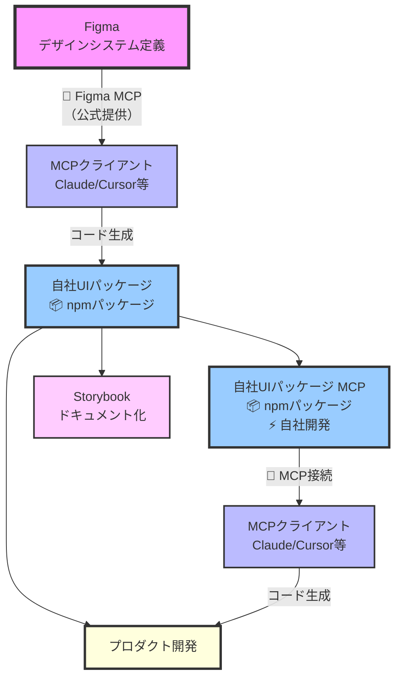

# AI駆動開発時代の新しいフロントエンド：デザインシステムとMCPが生み出す一貫性

## はじめに

AI駆動開発が急速に普及する中、フロントエンド開発における最大の課題は「**デザインの一貫性**」です。

本記事では、**デザインシステムを中心に据え、MCP（Model Context Protocol）を活用することで、AI時代でも一貫性のあるフロントエンド開発を実現する新しいアプローチ**を提案します。

## 課題：AIが生成するコードの「AIぽさ」

### Before: 従来のAI駆動開発

```jsx
// AIが生成した不統一なコード
<button style={{
  backgroundColor: '#3b82f6',  // ハードコードされた色
  padding: '12px 24px',        // 独自のスペーシング
  borderRadius: '8px'          // デザインシステムと異なる
}}>
  Submit
</button>
```

このようなコードには以下の問題があります：
- デザインシステムとの乖離
- スタイルの不統一
- 保守性の低下

## 解決策：デザインシステム中心のMCPサイクル

MCPを活用することで、**AIツールにあなたの会社のデザインシステムを教える**ことができます。

### 提案するアーキテクチャ

以下の図は、Figmaで定義したデザインシステムが、MCP経由でAIツールに伝わり、最終的に統一されたコードが生成される流れを示しています。



このサイクルの重要なポイント：

### 🔌 2つのMCPサーバーがデザインシステムの中核を担う
1. **Figma MCP**: Figma公式が提供、デザイン情報を取得
2. **自社UIパッケージ MCP**: **自社で開発**、UIパッケージの情報をAIに提供

### 📦 2つのプライベートnpmパッケージを社内配布
1. **@your-org/ui-library**: 実際のReactコンポーネント群
2. **@your-org/ui-mcp**: **自社開発のMCPサーバー**（UIパッケージ情報を提供）

これにより：
- 開発者は**npmインストールで直接UIパッケージを利用**
- AIツールは**npxコマンドでMCPサーバーを起動**し、UIパッケージを理解
- **MCP経由で適切なコード生成**を実現
- **全プロダクトのコードがデザインシステムに100%準拠**

## 実装の流れ

### 1. Figmaでデザインシステムを定義

Figma上で以下の要素を定義していきます：

#### デザインシステムの構成要素

1. **Typography（タイポグラフィ）**
   - フォントファミリー、サイズ、ウェイト、行間の定義
   - 見出し、本文、キャプションなどの用途別スタイル

2. **Colors（カラー）**
   - Primitive Colors: 基本となる色のパレット
   - Semantic Colors: 用途別の色（primary、secondary、error等）

3. **Icons（アイコン）**
   - システム全体で使用するアイコンセット
   - 統一されたサイズとストロークの太さ

4. **UI Components（UIコンポーネント）**
   - ボタン、フォーム、カード、モーダルなど
   - 各コンポーネントのバリアント（状態やサイズ）

### 2. Figma MCPでデザイン情報を取得

Figma MCPを使うことで、FigmaとMCPクライアント（Claude、Cursor等のAIツール）が直接連携できるようになります。Figmaデスクトップ上で選択しているデザイン情報を直接MCPクライアントに送ることができるのです。

#### Figma MCPのセットアップ

##### ステップ1: Figmaデスクトップアプリの準備
1. **Figmaデスクトップアプリをインストール**
   - [Figma Downloads](https://www.figma.com/downloads/)からダウンロード
   - デスクトップアプリでのみMCPサーバー機能が利用可能

2. **開発者モードを有効化**
   - Figmaデスクトップアプリの設定 → 「開発者向け」
   - 「MCPサーバーを有効にする」をON

##### ステップ2: MCPクライアント側の設定
```json
// mcp.json
{
  "mcpServers": {
    "figma-dev-mode-mcp-server": {
      "url": "http://127.0.0.1:3845/mcp"
    }
  }
}
```

### 3. 自社UIパッケージの作成

Figmaで定義したデザインシステムを、実際のコードに変換します。UIパッケージ（`@your-org/ui-library`）はnpmパッケージとして管理し、開発者が直接インポートして使用できるようにします。

#### Figmaからコードへの変換マッピング

ステップ1で定義した各要素を、それぞれ最適な技術で実装します：

##### 1. Typography → Tailwind CSS v4のCSS変数
```css
/* Typography */
@theme {
  --font-size-xs: 0.75rem;
  --font-size-sm: 0.875rem;
  --font-size-base: 1rem;
  --font-size-lg: 1.125rem;
  
  --font-weight-normal: 400;
  --font-weight-medium: 500;
  --font-weight-bold: 700;
  
  --line-height-tight: 1.25;
  --line-height-normal: 1.5;
  --line-height-relaxed: 1.75;
}
```

##### 2. Colors → Tailwind CSS v4のCSS変数（Primitive + Semantic）
```css
/* Primitive Colors (基本色) */
@theme {
  --color-blue-50: #eff6ff;
  --color-blue-500: #3b82f6;
  --color-blue-900: #1e3a8a;
  --color-red-50: #fef2f2;
  --color-red-500: #ef4444;
  --color-red-900: #7f1d1d;
}

/* Semantic Colors (意味を持つ色) - Primitiveを参照 */
@theme {
  --color-primary: var(--color-blue-500);
  --color-destructive: var(--color-red-500);
}
```

##### 3. Icons → SVGコンポーネント
```tsx
export const CheckIcon = ({ className, ...props }: SVGProps<SVGSVGElement>) => (
  <svg
    className={cn("h-4 w-4", className)}
    viewBox="0 0 24 24"
    fill="none"
    stroke="currentColor"
    strokeWidth="2"
    {...props}
  >
    <path d="M20 6L9 17l-5-5" />
  </svg>
);
```

##### 4. UI Components → shadcn/uiアプローチ
Figmaで定義されたUIコンポーネント（ボタン、カード、モーダルなど）は、**shadcn/ui**と同じ技術スタックで実装します。

**採用する技術スタック：**
- **Radix UI**: アクセシビリティと動作を提供するヘッドレスコンポーネント
- **Tailwind CSS**: ユーティリティファーストのCSSフレームワーク
- **cva**: コンポーネントのバリアント（見た目の変化）を管理するライブラリ
- **cn**: 複数のクラス名を適切に結合するユーティリティ関数

```tsx
import { cva, type VariantProps } from "class-variance-authority"

const buttonVariants = cva(
  "inline-flex items-center justify-center rounded-md text-sm font-medium transition-colors",
  {
    variants: {
      variant: {
        primary: "bg-primary text-white shadow hover:bg-primary/90",
        secondary: "bg-secondary text-secondary-foreground hover:bg-secondary/80",
        destructive: "bg-destructive text-white hover:bg-destructive/90",
        outline: "border border-input bg-background hover:bg-accent",
        ghost: "hover:bg-accent hover:text-accent-foreground",
      },
      size: {
        sm: "h-8 px-3 text-xs",
        md: "h-9 px-4 py-2",
        lg: "h-10 px-8",
      },
    },
    defaultVariants: {
      variant: "primary",
      size: "md",
    },
  }
)

// 実際の使用例
<Button variant="primary" size="md">Submit</Button>
```

**shadcn/uiの構造を参考にしながら、Figmaのデザインシステムを実装する**ことで、実績のあるアーキテクチャを活用できます。

### 4. Storybookでドキュメント化

生成されたコンポーネントをStorybookで可視化し、開発者とデザイナーが同じビジョンを共有できるようにします。
このタイミングでデザイナーにレビューしてもらい、Figmaのデザインが正しくコード化されているか確認することが重要です。

### 5. 自社UIパッケージ用MCPサーバーの作成

MCPクライアントがUIパッケージを理解し、適切に使用できるようにするMCPサーバー（`@your-org/ui-mcp`）を作成します。これもnpmパッケージとして管理し、MCPクライアントがコンポーネントを理解するために使用します。

#### 必要なMCPツール

以下の6つのツールを実装することで、MCPクライアントがUIパッケージを活用できるようになります：

1. **`get_available_components`** - 利用可能なコンポーネント一覧を取得
2. **`get_component`** - 特定コンポーネントの詳細（props、バリアント、使用例）を取得
3. **`get_available_icons`** - 利用可能なアイコン一覧を取得
4. **`get_icon`** - 特定アイコンのSVGコードやReactコンポーネントを取得
5. **`get_available_styles`** - 利用可能なスタイル（カラー、タイポグラフィ等）一覧を取得
6. **`get_style`** - 特定スタイルの詳細（CSS変数、値）を取得

#### 実装の参考

実際にUIパッケージ用のMCPサーバーを作成した例として、[Kurage UIのMCPサーバー実装](https://zenn.dev/uniformnext/articles/kurage-ui-mcp)があります。具体的な実装方法やコード例はこちらの記事を参考にしてください。

### 6. npmパッケージとして社内配布

上記で作成した2つのパッケージをGitHub Packagesにプライベート公開します。

#### パッケージの公開（publish）

```bash
# package.jsonにpublishConfig を追加
{
  "name": "@your-org/ui-library",
  "publishConfig": {
    "registry": "https://npm.pkg.github.com"
  }
}

# GitHub PATでログイン（write:packages権限が必要）
npm login --registry=https://npm.pkg.github.com

# パッケージを公開
npm publish
```

### 7. 配布されたパッケージの利用

#### プライベートパッケージを使用するための準備

プライベート公開されたパッケージを使用するには、以下の2つが必要です：

1. **GitHub Personal Access Token (PAT)** の取得
   - GitHubの Settings → Developer settings → Personal access tokens で作成
   - `read:packages` 権限が必要

2. **プロジェクトルートに `.npmrc` ファイルを作成**

```bash
# .npmrcの設定（プロジェクトルートに配置）
@your-org:registry=https://npm.pkg.github.com
//npm.pkg.github.com/:_authToken=${GITHUB_TOKEN}
```

#### UIパッケージのインストール

```bash
# UIパッケージをプロジェクトに追加
npm install @your-org/ui-library
```

#### MCPクライアント側での設定

```json
// mcp.json
{
  "mcpServers": {
    "your-org-ui": {
      "command": "npx",
      "args": ["@your-org/ui-mcp"]
    }
  }
}
```

## 結果：MCPクライアントも人も使える統一されたUI

### After: デザインシステム中心の開発

```jsx
// MCPを通じて生成された統一感のあるコード
import { Button } from '@your-org/ui-library';
import { CheckIcon } from '@your-org/ui-library/icons';

<Button variant="primary" size="medium">
  <CheckIcon className="mr-2" />
  Submit
</Button>
```

### MCPがもたらす開発体験

開発者が「ユーザー登録フォームを作って」と伝えるだけで、MCPクライアントは：

1. **UIパッケージから適切なコンポーネントを選択**
   - 自社のButtonやInputコンポーネントを使用
   - デザインシステムに準拠したスペーシングやカラーを適用

2. **一貫性のあるコードを自動生成**
   - ハードコードされた色ではなく、CSS変数を使用
   - 正しいバリアントとサイズの組み合わせ

3. **ベストプラクティスの自動適用**
   - アクセシビリティ対応
   - レスポンシブデザイン
   - エラーハンドリング

つまり、MCPクライアントが「あなたの会社のデザインシステム」を理解しているため、生成されるコードは最初から統一感があり、手直しが最小限で済むのです。

## まとめ

「**Figma → MCP → UIパッケージ → MCP → プロダクト**」というサイクルにより、AI時代でも人間中心のデザインを維持しながら、開発効率を最大化できます。