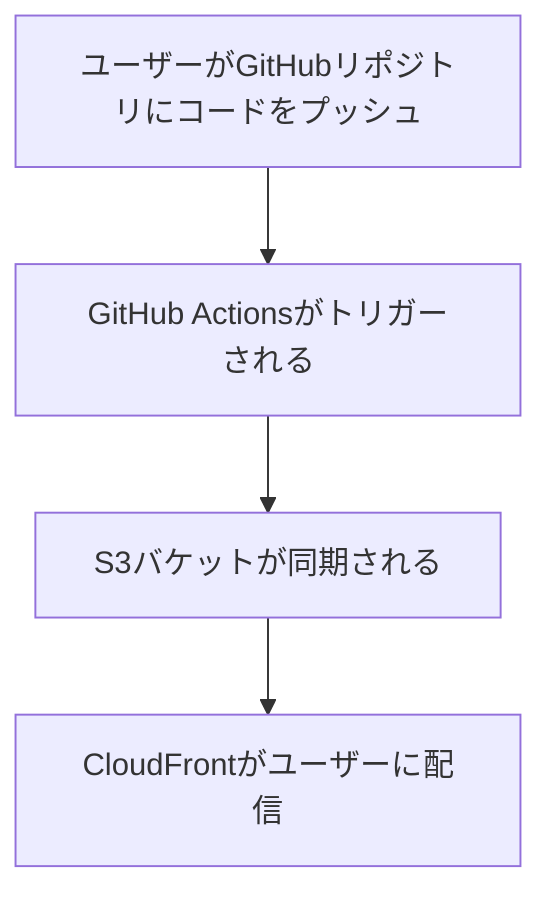

## 手順一覧

1. GitHub リポジトリを作成します。
2. AWS アカウントで S3 バケットを作成します。
   ```sh
   aws s3 mb s3://githubaction-bucket-141
   ```
3. CloudFront ディストリビューションを作成し、S3 バケットをオリジンとして選択します。
   ```sh
   aws cloudfront create-distribution \
     --origin-domain-name <bucket-name>.s3.amazonaws.com \
     --default-root-object index.html
   ```
   - S3 リソースへのアクセスを制限するために OAC（オリジンアクセスコントロール）を作成してください。
4. CloudFront 配信用の index.html ファイルを GitHub リポジトリに作成します。
5. GitHub を OIDC プロバイダーを使って AWS に認証します。
6. AWS コンソールで新しいアイデンティティを作成します。
7. GitHub Actions を設定します。
   - `.github/workflows/`ディレクトリに`deploy.yaml`という名前のファイルを作成します。
   - 以下の内容を記述します。

---

```yaml
name: AWS S3 workflow
on: push
env:
  BUCKET_NAME: "<bucketname>"
  AWS_REGION: "ap-south-1"
permissions:
  id-token: write
  contents: read
jobs:
  S3PackageUpload:
    runs-on: ubuntu-latest
    steps:
      - name: リポジトリをクローン
        uses: actions/checkout@v4
      #  - name: Node.jsのセットアップ
      #    uses: actions/setup-node@v3
      #    with:
      #      node-version: '16' # プロジェクトで使用しているNode.jsのバージョンに置き換えてください

      #  - name: 依存関係のインストール
      #    run: npm install

      #  - name: プロジェクトのビルド
      #    run: npm run build
      - name: AWS認証情報の設定
        uses: aws-actions/configure-aws-credentials@e3dd6a429d7300a6a4c196c26e071d42e0343502
        with:
          role-to-assume: <role_arn>
          role-session-name: samplerolesession
          aws-region: ${{ env.AWS_REGION }}
      - name: S3バケットと同期
        run: |
          aws s3 sync . s3://${{ env.BUCKET_NAME }}
          aws cloudfront create-invalidation --distribution-id <distribution_id> --paths '/*'
```

---
