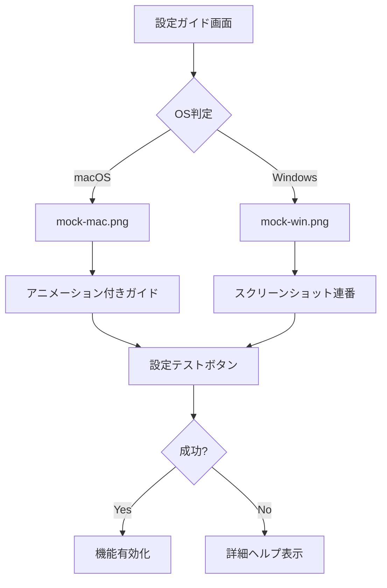

#electron 

## 1. 基本レイアウト
```plaintext
[ヘッダー領域]
  ⚙️ システム設定が必要です
  （アイコン + 短いヘッダー）

[メインコンテンツ領域]
  📝 説明文
  🖼️ スクリーンショット/アニメーション
  ▶️ 操作ステップ

[フッター領域]
  🎥 ビデオチュートリアルリンク
  🆘 サポート問い合わせ
```

## 2. macOS向け具体例
### 画面収録許可ガイド
```plaintext
🔒 セキュリティ保護のため、手動での設定が必要です

[アニメーションGIF]
1. 画面下部のDockで「システム設定」を開く
2. 「プライバシー & セキュリティ」を選択
3. 左メニューで「画面収録」をクリック
4. 「+」ボタンから当アプリを追加
5. チェックボックスをONにする

[ボタン群]
[ システム設定を開く ]  [ 設定完了した ]  [ 後でする ]
```

### スクリーンショット仕様
| 番号 | 内容 | 注釈 |
|------|------|------|
| 1 | システム設定アイコン | 赤丸で強調 |
| 2 | プライバシー選択画面 | 矢印アノテーション |
| 3 | 画面収録設定画面 | 当アプリ部分をハイライト |

## 3. Windows向け具体例
### 画面録画許可ガイド
```plaintext
🖼️ 画面へのアクセスを許可してください

[スクリーンショット連番]
1. 「設定」→「プライバシー」→「アプリのアクセス許可」
2. 「画面記録」タブを選択
3. 当アプリのトグルをONに切り替え

[ボタン群]
[ 設定を開く ]  [ スクショを見る ]  [ スキップ ]
```

## 4. 動的UIコンポーネント
```javascript
// システム設定を開くボタンの実装例
const openSystemPreferences = () => {
  // macOS
  if (process.platform === 'darwin') {
    shell.openExternal('x-apple.systempreferences:com.apple.preference.security?Privacy_ScreenCapture');
  }
  // Windows
  else {
    shell.openExternal('ms-settings:privacy-webcam');
  }
};

// 設定完了検知ロジック
setInterval(() => {
  if (checkPermission()) {
    hideGuideWindow();
  }
}, 5000);
```

## 5. エラーケース対応
### 設定が見つからない場合
```plaintext
⚠️ 設定画面が見つかりませんでした

考えられる原因:
1. OSのバージョンが古い
2. 管理者制限がかかっている

[解決策]
✅ こちらのマニュアルページを参照してください
[マニュアルを開く]

または動画で確認:
[▶️ チュートリアル再生]
```

## 6. アクセシビリティ配慮
- スクリーンショットにaltテキストを付与
  ```html
  
  ```
- キーボード操作対応
  ```javascript
  document.addEventListener('keydown', (e) => {
    if (e.key === 'Escape') closeModal();
  });
  ```

## 7. 多言語対応例
```json
{
  "permission_guide": {
    "title": {
      "en": "System Settings Required",
      "ja": "システム設定が必要です",
      "es": "Configuración del sistema requerida"
    },
    "steps": {
      "en": ["Open System Preferences", "Select Privacy"],
      "ja": ["システム環境設定を開く", "プライバシーを選択"],
      "es": ["Abrir Preferencias", "Seleccionar Privacidad"]
    }
  }
}
```

## 8. 推奨UIコンポーネント


