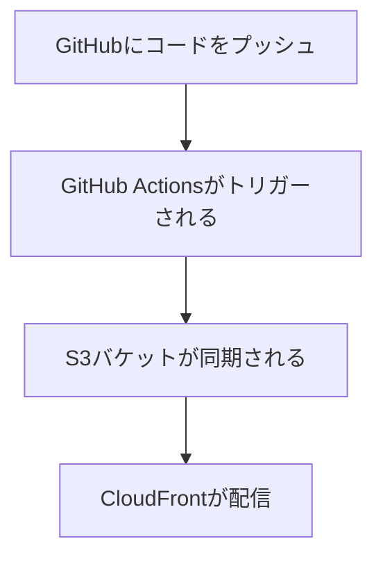

【タスク】: CloudFrontを使用したWebサイト配信の設定
【対象レベル】: 中級〜上級

## 🎯 このガイドのゴール
GitHub Actionsを使用してS3に自動デプロイし、[[🔍CloudFront]]で高速配信する完全なCI/CDパイプラインを構築する

## ⏱️ 所要時間
約30〜45分

## 🧰 必要なもの
- GitHubアカウント
- AWSアカウント
- AWS CLIがインストール済み
- Gitの基本操作知識

## 📝 手順概要
1. GitHubリポジトリの作成
2. S3バケットの作成
3. [[🔍CloudFront distribution]]の設定
4. [[🔍OAC]]の設定
5. GitHub Actionsの設定
6. OIDC認証の設定

## 🔧 詳細手順

### Step 1: 実行フローの理解


### Step 2: S3バケットの作成
```bash
aws s3 mb s3://githubaction-bucket-141
```

### Step 3: CloudFront distributionの作成
```bash
aws cloudfront create-distribution \
  --origin-domain-name <bucket-name>.s3.amazonaws.com \
  --default-root-object index.html
```

### Step 4: セキュリティ設定
- [[🔍OAC]]を作成
- 関連設定：[[📋CloudFront OAC設定ガイド]]

### Step 5: GitHub認証設定
- [[📋GitHub OIDC AWS認証ガイド]]
- AWSコンソールで新しいアイデンティティを作成

### Step 6: GitHub Actions設定
`.github/workflows/deploy.yaml`を作成：

```yaml
name: AWS S3 workflow
on: push
env:
  BUCKET_NAME: "<bucketname>"
  AWS_REGION: "ap-south-1"
permissions:
  id-token: write
  contents: read
jobs:
  S3PackageUpload:
    runs-on: ubuntu-latest
    steps:
      - name: リポジトリをクローン
        uses: actions/checkout@v4
      - name: AWS認証情報の設定
        uses: aws-actions/configure-aws-credentials@e3dd6a429d7300a6a4c196c26e071d42e0343502
        with:
          role-to-assume: <role_arn>
          role-session-name: samplerolesession
          aws-region: ${{ env.AWS_REGION }}
      - name: S3バケットと同期
        run: |
          aws s3 sync . s3://${{ env.BUCKET_NAME }}
          aws cloudfront create-invalidation --distribution-id <distribution_id> --paths '/*'
```

## ✅ 完了チェック
- [ ] GitHubリポジトリが作成されている
- [ ] S3バケットが作成されている
- [ ] [[🔍CloudFront distribution]]が設定されている
- [ ] [[🔍OAC]]が正しく設定されている
- [ ] GitHub Actionsが正常に動作している

## 🚨 よくある失敗と対策
- **権限エラー**: OIDC設定とIAMロールを確認
- **デプロイ失敗**: S3バケット名とリージョンを確認
- **キャッシュ問題**: [[🔍CloudFront]]キャッシュの無効化を実行

## 🔄 関連リンク
- GitHub Actionsの基本概念
- [[📋CloudFront OAC設定ガイド]]

## 🚀 次のステップ
- [[📋CloudFront Basic認証設定ガイド]]
- [[💡S3 sync --delete オプションの効果]]
- 高度なCI/CD設定

**参考**: https://www.youtube.com/watch?v=WSiV0Q0zvEI