**タイプ**: 📋 Guide

## 📝 一行要約
GitHub ActionsでS3に自動デプロイし、CloudFrontで高速配信する完全なCI/CDパイプライン構築手順

## 🎯 最終ゴール
[[CloudFront]]で高速配信する完全なCI/CDパイプラインを構築する

## 🧰 必要なもの
- GitHubアカウント
- AWSアカウント
- AWS CLIがインストール済み
- Gitの基本操作知識

## 📝 手順概要
1. GitHubリポジトリの作成
2. S3バケットの作成
3. [[CloudFront distribution]]の設定
4. [[OAC]]の設定
5. GitHub Actionsの設定
6. OIDC認証の設定

## 🔧 詳細手順

### Step 1: 実行フローの理解

```mermaid
graph TD
    A[GitHubにコードをプッシュ] --> B[GitHub Actionsがトリガーされる]
    B --> C[S3バケットが同期される]
    C --> D[CloudFrontが配信]
```


### Step 2: S3バケットの作成
```bash
aws s3 mb s3://githubaction-bucket-141
```

### Step 3: CloudFront distributionの作成
```bash
aws cloudfront create-distribution \
  --origin-domain-name <bucket-name>.s3.amazonaws.com \
  --default-root-object index.html
```

### Step 4: セキュリティ設定
- [[OAC]]を作成
- 関連設定：[[CloudFront OAC設定ガイド]]

### Step 5: GitHub認証設定
- [[GitHub OIDC AWS認証ガイド]]
- AWSコンソールで新しいアイデンティティを作成

### Step 6: GitHub Actions設定
`.github/workflows/deploy.yaml`を作成：

```yaml
name: AWS S3 workflow
on: push
env:
  BUCKET_NAME: "<bucketname>"
  AWS_REGION: "ap-south-1"
permissions:
  id-token: write
  contents: read
jobs:
  S3PackageUpload:
    runs-on: ubuntu-latest
    steps:
      - name: リポジトリをクローン
        uses: actions/checkout@v4
      - name: AWS認証情報の設定
        uses: aws-actions/configure-aws-credentials@e3dd6a429d7300a6a4c196c26e071d42e0343502
        with:
          role-to-assume: <role_arn>
          role-session-name: samplerolesession
          aws-region: ${{ env.AWS_REGION }}
      - name: S3バケットと同期
        run: |
          aws s3 sync . s3://${{ env.BUCKET_NAME }}
          aws cloudfront create-invalidation --distribution-id <distribution_id> --paths '/*'
```

## 🔧 トラブルシューティング
- **権限エラー**: OIDC設定とIAMロールを確認
- **デプロイ失敗**: S3バケット名とリージョンを確認
- **キャッシュ問題**: [[CloudFront]]キャッシュの無効化を実行

## 🔄 関連リンク
- GitHub Actionsの基本概念
- [[CloudFront OAC設定ガイド]]

## 🚀 次のステップ
- [[CloudFront Basic認証設定ガイド]]
- [[S3 sync --delete オプションの効果]]
- 高度なCI/CD設定

**参考**: https://www.youtube.com/watch?v=WSiV0Q0zvEI