【タスク】: CloudFrontを使用したWebサイト配信の設定
【対象レベル】: 中級〜上級

## 🎯 このガイドのゴール
[[GitHub Actions]]を使用して[[S3]]に自動デプロイし、[[CloudFront]]で高速配信する完全な[[CI/CD]]パイプラインを構築する

## ⏱️ 所要時間
約30〜45分

## 🧰 必要なもの
- [[GitHub]]アカウント
- [[AWS]]アカウント
- [[AWS CLI]]がインストール済み
- [[Git]]の基本操作知識

## 📝 手順概要
1. [[GitHub]]リポジトリの作成
2. [[S3]]バケットの作成
3. [[CloudFront distribution]]の設定
4. [[OAC]]（オリジンアクセスコントロール）の設定
5. [[GitHub Actions]]の設定
6. [[OIDC]]認証の設定

## 🔧 詳細手順

### Step 1: 実行フローの理解

```mermaid
graph TD
    A[GitHubにコードをプッシュ] --> B[GitHub Actionsがトリガーされる]
    B --> C[S3バケットが同期される]
    C --> D[CloudFrontが配信]
```


### Step 2: S3バケットの作成
```bash
aws s3 mb s3://githubaction-bucket-141
```

### Step 3: CloudFront distributionの作成
```bash
aws cloudfront create-distribution \
  --origin-domain-name <bucket-name>.s3.amazonaws.com \
  --default-root-object index.html
```

### Step 4: セキュリティ設定
- [[OAC（オリジンアクセスコントロール）]]を作成
- 関連設定：[[S3のOAC設定]]、[[CloudFrontのOAC設定]]

### Step 5: GitHub認証設定
- [[GitHub を OIDC プロバイダーを使って AWS に認証]]
- [[AWS]]コンソールで新しいアイデンティティを作成

### Step 6: GitHub Actions設定
`.github/workflows/deploy.yaml`を作成：

```yaml
name: AWS S3 workflow
on: push
env:
  BUCKET_NAME: "<bucketname>"
  AWS_REGION: "ap-south-1"
permissions:
  id-token: write
  contents: read
jobs:
  S3PackageUpload:
    runs-on: ubuntu-latest
    steps:
      - name: リポジトリをクローン
        uses: actions/checkout@v4
      - name: AWS認証情報の設定
        uses: aws-actions/configure-aws-credentials@e3dd6a429d7300a6a4c196c26e071d42e0343502
        with:
          role-to-assume: <role_arn>
          role-session-name: samplerolesession
          aws-region: ${{ env.AWS_REGION }}
      - name: S3バケットと同期
        run: |
          aws s3 sync . s3://${{ env.BUCKET_NAME }}
          aws cloudfront create-invalidation --distribution-id <distribution_id> --paths '/*'
```

## ✅ 完了チェック
- [ ] [[GitHub]]リポジトリが作成されている
- [ ] [[S3]]バケットが作成されている
- [ ] [[CloudFront distribution]]が設定されている
- [ ] [[OAC]]が正しく設定されている
- [ ] [[GitHub Actions]]が正常に動作している

## 🚨 よくある失敗と対策
- **権限エラー**: [[OIDC]]設定と[[IAM]]ロールを確認
- **デプロイ失敗**: [[S3]]バケット名とリージョンを確認
- **キャッシュ問題**: [[CloudFront]]キャッシュの[[無効化]]を実行

## 🔄 関連リンク
- [[GitHub Actions]]の基本概念
- [[S3 へのデプロイ with Github Action]]
- [[CloudFrontのOAC設定]]

## 🚀 次のステップ
- [[CloudFront FunctionsでBasic認証のパスワードをかける]]
- [[S3のオプション --delete]]
- [[高度なCI/CD設定]]

**参考**: https://www.youtube.com/watch?v=WSiV0Q0zvEI